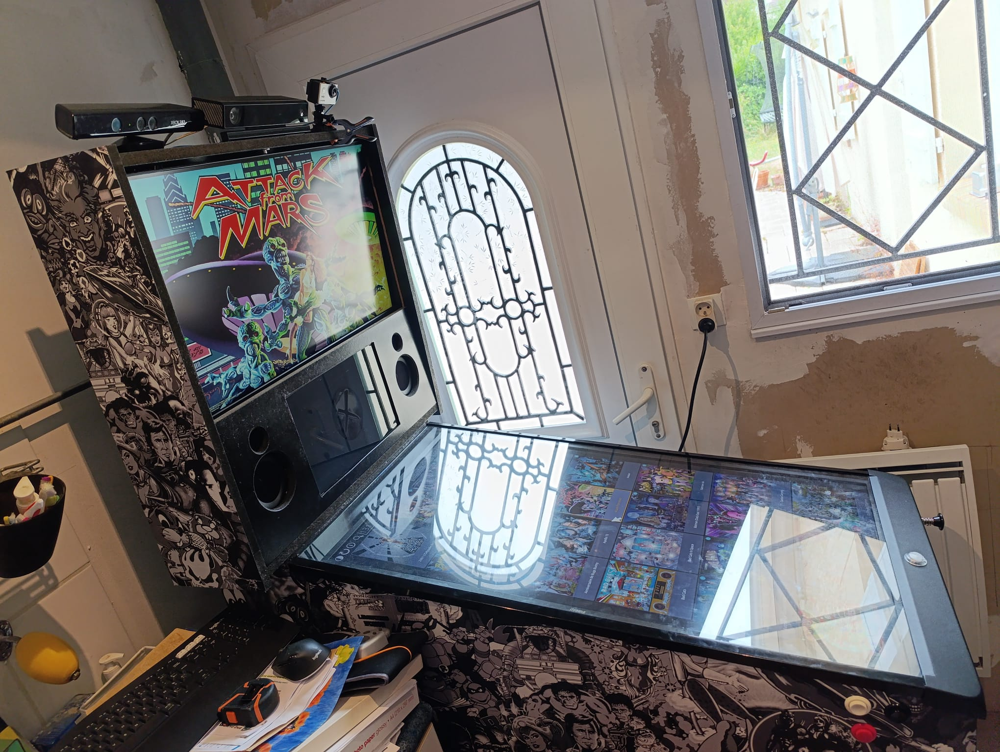
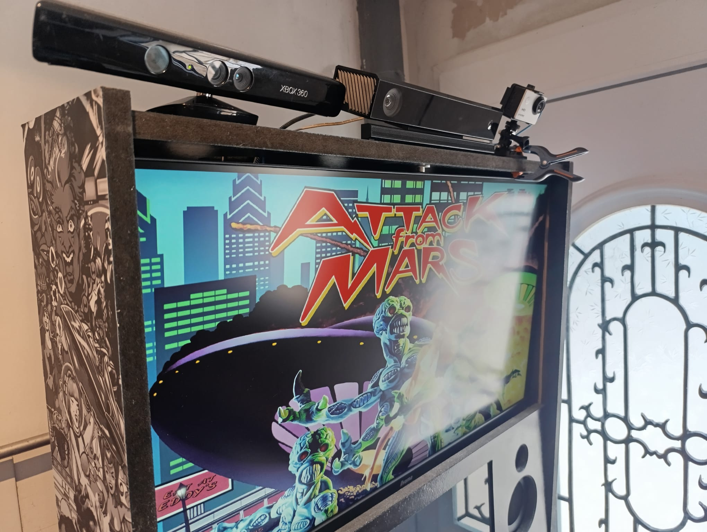
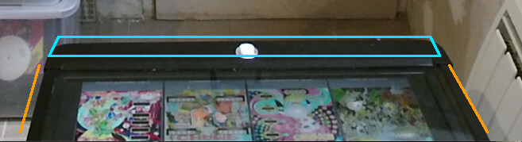
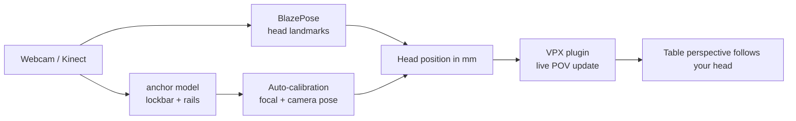
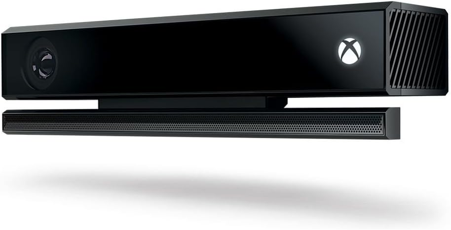
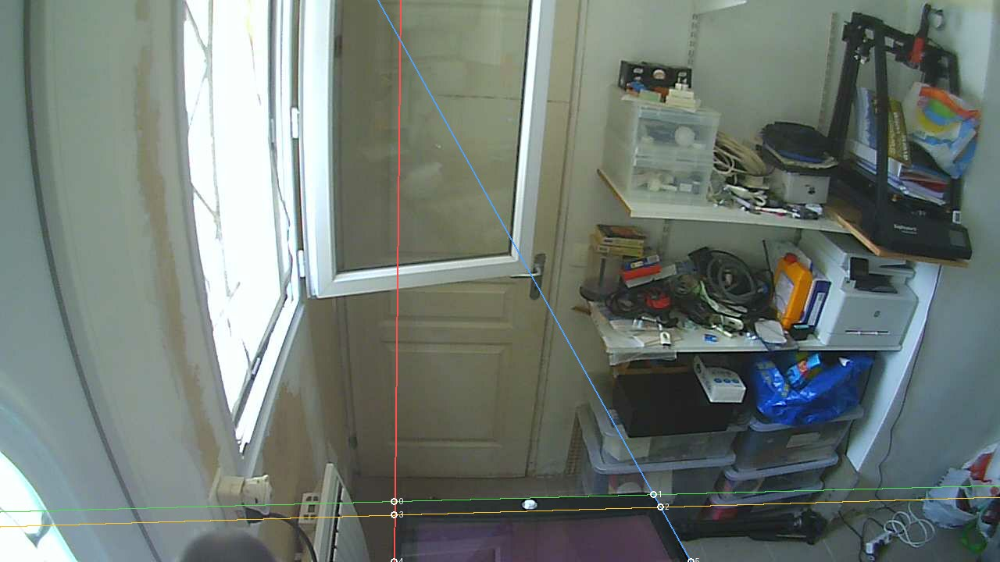
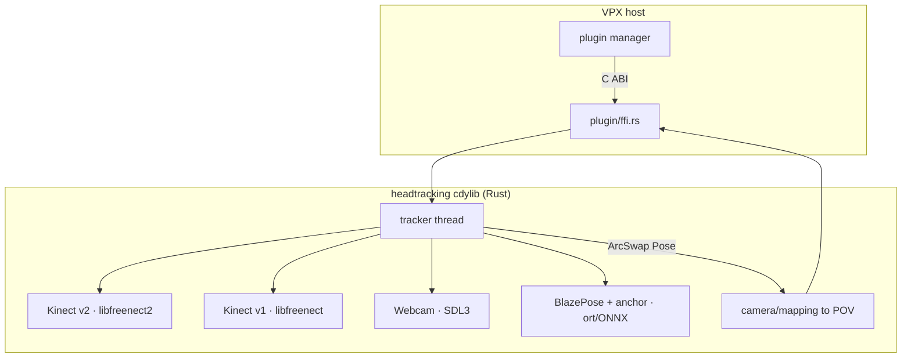

<div align="center">

# 🎯 headtracking

**Real-time head-tracked 3D point-of-view for [Visual Pinball X](https://github.com/vpinball/vpinball) — pure Rust, zero-install, self-calibrating.**

Move your head, the table's perspective follows — the *fish-tank VR* effect that
makes a flat screen feel like a real cabinet. An open-source, cross-platform
alternative to BAM, that works from a plain **webcam** or a **Kinect v1 / v2**.

[](LICENSE)
[](https://www.rust-lang.org/)
[]()
[]()
[](https://discord.gg/cFcNrt9AY)
[](#-contributors-wanted)

**🇬🇧 [English](#-what-makes-it-different) · 🇫🇷 [Français](#-français)**

<table><tr>
<td></td>
<td></td>
<td></td>
</tr></table>

<sub>A real pincab (Attack from Mars): the tracking rig on the backbox, and the cabinet reference frame the model detects.</sub>

</div>

---

## ✨ What makes it different

Head tracking for pinball isn't new. Doing it **without asking the user to
calibrate anything** is. That's the whole bet of this project:

- **Zero manual calibration.** The cabinet itself is the calibration target. The
  lockbar and the two side rails form a **known rectangle** of the playfield. Seen
  in perspective, that's enough to recover the camera's focal length *and* its
  pose relative to the table — from the image alone. No checkerboard, no wizard,
  no "look here and press space".

  

  <sub>The reference frame the model finds: lockbar (box) + the two side rails → camera pose, automatically.</sub>

- **3D from a plain webcam.** No depth sensor required: the recovered focal turns
  a single camera into a metric 3D head tracker. Kinect depth is a bonus, not a
  requirement.
- **Zero install for the end user.** One plugin binary. No Microsoft SDK, no
  Python, no drivers to hunt down — `libfreenect`/`libfreenect2` and the ONNX
  runtime are all statically linked.
- **100 % Rust**, cross-platform (Linux · Windows · macOS), GPL-3.0.

## 🧠 How it works



Two ONNX models run per frame through [`ort`](https://ort.pyke.io/): **BlazePose**
finds the head (~7 ms), and the **`anchor`** model locates the cabinet's reference
frame. A pure-Rust decoder turns that frame into the camera's focal length and
pose (vanishing points + single-plane homography), then every head pixel
deprojects into real millimetres and drives the table's point of view.

The auto-calibration toolkit — draw a few lines on cabinet photos, get an ONNX
model — lives in **[`tools/anchor/`](tools/anchor/)** with its own guide.

## 🎥 Which camera? Grab a second-hand Kinect v2



Every backend works, but the sweet spot is a used **Kinect v2 (Xbox One)** —
and it's absurdly cheap since Microsoft discontinued it:

- **From ~€20** on leboncoin / eBay / your local classifieds — there are tons
  of listings.
- It tracks on its **infrared stream**: the sensor lights the scene itself,
  so you get full 30 fps in a pitch-dark game room where a webcam struggles.
- Real **depth sensor** → your head distance is *measured* in millimetres,
  not estimated.
- ⚠️ Budget for the **Kinect Adapter** (power + USB 3.0,
  [~€29 new](https://amzn.eu/d/08mV466T)) unless the listing includes it —
  check before buying. Total ~€50 all-in.
- Plug it into a **dedicated USB 3.0 port** on the motherboard's back panel
  (it won't enumerate behind a shared hub).
- Mounting on the cab: a
  [1/4"-20 screw assortment kit](https://amzn.eu/d/05Pmh3l6) (~€11 for 40
  stainless pieces — 7 lengths from 5/16" to 1", spacers and wrench
  included) is all it takes to fix the sensor on top of the backglass or
  the topper. In a hurry? Both the adapter and the screw kit ship with
  Prime — next-day delivery.

The **Kinect v1** (Xbox 360) is even cheaper and field-tested too — lower
resolution but perfectly usable. And a plain **webcam** costs nothing if you
already have one: auto-calibration recovers real 3D from it (that's the whole
point of this project) — the Kinect's IR just wins in a dark cabinet.

## 🚧 Status — honestly

This is **early development**, released as **beta**. It builds for Linux,
Windows and macOS, and the full chain — camera → auto-calibration →
live POV inside a running VPX — is now **field-validated on a real Linux
pincab** (Kinect v2, Kinect v1 and webcam, Window view mode). Windows and
macOS runs are exactly what we need testers for.

> [!CAUTION]
> ### ⚠️ Windows + Kinect users — read this BEFORE installing anything
> To let this project access a Kinect, the bundled driver setup **replaces
> Microsoft's official Kinect driver** with a generic WinUSB one.
> **This breaks everything built on the Microsoft Kinect SDK — including a
> working BAM head-tracking setup — until you restore the original driver**
> (Device Manager → the "Xbox NUI" devices → uninstall our driver, rescan, or
> reinstall the Kinect SDK/runtime). Only run the Kinect driver setup if you
> accept that trade. **Webcam users are not affected.**

| Piece | State |
|-------|-------|
| VPX plugin loads & builds (Linux/Windows/macOS) | ✅ |
| Kinect v2 capture + head blob | ✅ operational |
| Kinect v1 capture | ✅ |
| Webcam capture (SDL3) | ✅ |
| BlazePose head tracking (ONNX, ~7 ms) | ✅ proven on real captures |
| Standalone demo + fish-tank parallax window | ✅ `headtracking-demo` |
| Auto-calibration maths (focal + pose) | ✅ validated to ±0–3 % vs tape measure |
| `anchor` training pipeline (lines → ONNX) | ✅ validated end-to-end |
| Trained, generalizing `anchor` model | 🚧 needs annotated photos |
| Live POV inside VPX, end-to-end | ✅ field-validated on a real Linux pincab |
| In-game settings (F12 → Plugin Settings), live tuning | ✅ |
| Windows / macOS real-world runs | 🚧 needs testers |

## 📸 We need captures of YOUR pincab — 2 minutes, no coding

**This is the project's #1 bottleneck, and anyone with a pincab can fix it.**
The auto-calibration model currently knows exactly one cabinet: ours. To learn
what *every* lockbar and rail look like — every wood tone, lighting, camera
angle — it needs to see real cabinets. Yours.

1. Download **`headtracking-demo`** from the
   [latest release](https://github.com/Le-Syl21/headtracking/releases) — a
   single binary, nothing to install.
2. Point your webcam or Kinect at the playfield, select it in the demo.
3. Click **🎁 Contribute** and confirm.

That's it. The demo uploads a capture set (colour image + what the detector
saw + depth/IR when a Kinect is there) to a write-only drop, and it becomes
training data.



<sub>What we extract from your capture: the lockbar's two edges, the two side
rails, and their 6 intersection points — the cabinet's reference frame.</sub>

**What gets shared, honestly:** the images show your cabinet and whatever is
around it — check the preview before accepting. Uploads need no account and carry no identity; each capture has a printed ID you can quote on Discord
to have it removed. Empty cab or mid-game, day or night, every variation
helps — captures with **a player standing at the cab** are the rarest and
most valuable.

## 🙌 Contributors wanted

**This project needs a small crew to go from "the hard parts work" to "you can
install it and play".** If any of this sounds like your kind of fun, jump in — no
permission needed, open an issue or say hi on Discord.

- 📸 **Send a capture of your pincab** *(biggest lever, no coding — see
  [above](#-we-need-captures-of-your-pincab--2-minutes-no-coding))*, or go one
  step further and **annotate photos**: trace 4 lines per photo in a browser
  tool ([`tools/anchor/`](tools/anchor/)). More cabinets = a model that
  generalizes.
- 🦀 **Rust / systems** — the VPX plugin glue, the calibration decoder, the
  filter/POV mapping. Clean `cdylib`, no async soup.
- 👁️ **Computer vision / ML** — improve the head + anchor models, the
  vanishing-point/homography solver, webcam focal recovery.
- 🎛️ **VPX & pinball folks** — test the plugin on real tables, sanity-check the
  POV feel, tell us what a good cabinet setup needs.
- 🪟 **Windows / macOS testers** — it builds everywhere; it has run on Linux. Help
  us prove the other two.

New to the codebase? [`CLAUDE.md`](CLAUDE.md) is a full architecture tour, and the
issues tagged **good first issue** are a soft landing.

## 🔧 Build & run

```bash
git clone --recurse-submodules https://github.com/Le-Syl21/headtracking
cd headtracking

# Build the plugin (pick your backend)
cargo build --release --features kinect-v2      # or: all-trackers

# Try the trackers + fish-tank parallax window, no VPX needed
cargo run --release -p headtracking-demo --features kinect-v2
```

No user-facing dependencies to install: `libfreenect`, `libfreenect2`,
libjpeg-turbo and the ONNX runtime are vendored and statically linked. You need a
recent Rust (2024 edition), `cmake`, `libclang` (for bindgen) and `libusb-1.0`.
Full install / VPX config / per-OS Kinect setup: **[`docs/INSTALL.md`](docs/INSTALL.md)**.

### Install into VPX

Drop the built library into VPX's (10.8.1+) plugin folder:

```
<VPX_install>/plugins/headtracking/
├── plugin.cfg
├── headtracking.dll          # Windows
├── libheadtracking.so        # Linux
└── libheadtracking.dylib     # macOS
```

Then in a table press **F12 → Plugin Settings → Head Tracking → Enable**.
Every setting (gain, smoothing, camera…) is tunable live from that page —
full walkthrough in [`docs/INSTALL.md`](docs/INSTALL.md).

Don't want to build? Besides the
[releases](https://github.com/Le-Syl21/headtracking/releases), **every
commit on `main` uploads fresh dev builds** (plugin + demo, all platforms)
as artifacts on the
[Actions tab](https://github.com/Le-Syl21/headtracking/actions/workflows/release.yml)
— unsigned, GitHub login required.

## 🗺️ Architecture



The tracker runs on its own thread and publishes the latest pose through an
`ArcSwap`; the VPX frame callback reads it without blocking. Everything crossing
the FFI boundary is `#[repr(C)]` and `catch_unwind`-guarded. Details in
[`CLAUDE.md`](CLAUDE.md).

## 💬 Community, support & beta testing

Bug reports, help, and **beta testing** happen on Discord — come say hi:

[](https://discord.gg/cFcNrt9AY)

Part of the wider [Le-Syl21 Tools](https://discord.gg/T37DYHmt2j) community.

## 📜 License

GPL-3.0-or-later. See [LICENSE](LICENSE).

---

## 🇫🇷 Français

**🇬🇧 [English](#-what-makes-it-different) · 🇫🇷 Français**

**Head tracking POV temps réel pour Visual Pinball X, en Rust pur.** Tu bouges la
tête, la perspective de la table suit — l'effet *fish-tank VR* qui donne à un
écran plat la profondeur d'un vrai cab. Alternative open-source à BAM, multi-plateforme,
qui marche depuis une simple **webcam** ou une **Kinect v1 / v2**.

### 📸 On a besoin de relevés de VOTRE pincab — 2 minutes, sans coder

**C'est LE goulot du projet, et n'importe quel possesseur de pincab peut le
débloquer.** Le modèle d'auto-calibration ne connaît pour l'instant qu'un seul
cab : le nôtre. Pour apprendre à reconnaître toutes les lockbars et tous les
rails — chaque bois, chaque éclairage, chaque angle de caméra — il doit voir de
vrais cabs. Le vôtre.

1. Téléchargez **`headtracking-demo`** depuis la
   [dernière release](https://github.com/Le-Syl21/headtracking/releases) — un
   binaire unique, rien à installer.
2. Pointez votre webcam ou Kinect vers le plateau, sélectionnez-la dans la démo.
3. Cliquez **🎁 Contribute** et confirmez.

C'est tout. La démo envoie un relevé (image couleur + ce que le détecteur a vu
+ depth/IR si Kinect) vers un dépôt en écriture seule, et ça devient des
données d'entraînement.

**Ce qui est partagé, honnêtement :** les images montrent votre cab et ce qu'il
y a autour — vérifiez l'aperçu avant d'accepter. L'envoi ne demande aucun compte et n'embarque aucune identité ; chaque relevé a un identifiant affiché que vous
pouvez citer sur Discord pour demander sa suppression. Cab vide ou en pleine
partie, jour ou nuit, toute variation aide — les relevés avec **un joueur
devant le cab** sont les plus rares et les plus précieux.

**Ce qui le rend unique :**

- **Zéro calibration manuelle.** Le cab EST la mire : la lockbar + les 2 rails
  latéraux forment un rectangle connu du plateau. Vu en perspective, ça suffit à
  retrouver la focale **et** la pose de la caméra — depuis l'image seule. Pas de
  mire à damier, pas d'assistant, rien à régler.
- **3D depuis une simple webcam** — pas besoin de capteur de profondeur ; la
  focale récupérée transforme une caméra unique en tracker 3D métrique.
- **Zéro install côté utilisateur** — un seul binaire plugin, aucun SDK
  Microsoft, tout est lié statiquement.
- **100 % Rust**, Linux · Windows · macOS.

**🎥 Quelle caméra ? Une Kinect v2 d'occasion.** Tous les backends marchent,
mais le meilleur rapport qualité/prix est une **Kinect v2 (Xbox One)**
d'occasion — **dès ~20 €** sur leboncoin / eBay (les annonces pullulent
depuis l'arrêt par Microsoft). Elle tracke sur son **flux infrarouge** (le
capteur éclaire lui-même la scène : 30 fps plein pot dans un game room
noir) et son **capteur de profondeur** mesure la distance de tête en vrais
millimètres. ⚠️ Prévoir l'**adaptateur Kinect** (alim + USB 3.0,
[~29 € neuf](https://amzn.eu/d/08mV466T)) si l'annonce ne l'inclut pas —
vérifiez avant d'acheter. ~50 € tout compris, port **USB 3.0 dédié**
obligatoire. Pour la fixer sur le backglass ou le topper : un
[kit d'assortiment de vis 1/4"-20](https://amzn.eu/d/05Pmh3l6) (~11 € les
40 pièces inox — 7 longueurs de 5/16" à 1", entretoises et clé incluses)
suffit. Pour les pressés : adaptateur et visserie sont **Prime** —
livrés le lendemain. La Kinect v1 (encore moins chère) et une simple
webcam marchent aussi — l'auto-calibration reconstruit la 3D depuis la
webcam, c'est tout l'objet du projet.

**État :** début de développement, publié en **beta**. Ça compile pour Linux,
Windows et macOS, et la chaîne complète — caméra → auto-calibration → POV
live dans VPX — est **validée sur le terrain sur un vrai pincab Linux**
(Kinect v2, Kinect v1 et webcam, mode Window, réglages live via F12). Les
retours Windows/macOS sont exactement ce qu'on cherche. Voir le tableau
d'état plus haut. En bonus : chaque commit sur `main` publie des dev builds
fraîches (plugin + démo, toutes plateformes) dans l'onglet
[Actions](https://github.com/Le-Syl21/headtracking/actions/workflows/release.yml)
— non signées, compte GitHub requis.

> [!CAUTION]
> ### ⚠️ Utilisateurs Windows + Kinect — à lire AVANT toute installation
> Pour que ce projet accède à une Kinect, l'installeur de pilote fourni
> **remplace le pilote Kinect officiel de Microsoft** par un pilote WinUSB
> générique. **Ça casse tout ce qui repose sur le SDK Kinect Microsoft — y
> compris un head tracking BAM fonctionnel — jusqu'à restauration du pilote
> d'origine** (Gestionnaire de périphériques → périphériques « Xbox NUI » →
> désinstaller notre pilote puis re-scanner, ou réinstaller le SDK/runtime
> Kinect). Ne lancez l'installeur Kinect que si vous acceptez cet échange.
> **Les utilisateurs webcam ne sont pas concernés.**

**On cherche des contributeurs — aucune permission requise, ouvre une issue ou
passe sur le Discord :**

- 📸 **Envoyer un relevé de son pincab** *(le plus utile, sans coder — voir
  ci-dessus)*, ou aller plus loin et **annoter des photos** : tracer 4 lignes
  par photo dans un outil navigateur ([`tools/anchor/`](tools/anchor/)). Plus
  de cabs = un modèle qui généralise. C'est **la** priorité.
- 🦀 **Rust / systèmes**, 👁️ **vision / ML**, 🎛️ **pinball & VPX** (tester sur
  vraies tables), 🪟 **testeurs Windows / macOS**.

Nouveau ? [`CLAUDE.md`](CLAUDE.md) est la visite guidée complète de l'architecture.

**Support & beta-test** sur Discord :

[](https://discord.gg/cFcNrt9AY)
